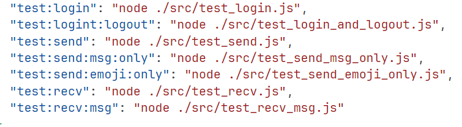

# Test Automation Code Execution Report

## Download the Project

```
git clone https://github.com/JLeung0107git/test-report1
```

## Install Dependencies (Node.js version should be greater than 18, use npm bundled with Node.js)

```
npm install
```

## Globally Install Appium

```
npm install -g appium
```

## Run the Appium Server

```
appium
```

## Download the Target Test Software Source Code

```
git clone https://github.com/Ctere1/react-native-chat/
```

## Install Dependencies (Node.js version should be greater than 18, use npm bundled with Node.js)

```
npm install
```

## Run

```
npx expo start
```

After successfully entering the Expo menu, input `i` to open with the simulator.

if you have any environment issues, please check the `SoftwaretestingReport.md` file

## Run the Scripts



```sh
npm run test:login  # on login page
npm run test:login:loginout # on login page
npm run test:send   # on chat page
npm run test:send:msg:only  # on chat page
npm run test:send:emoji:only  # on chat page
npm run test:recv  # on chat page
npm run test:recv:msg  # on chat page
```
